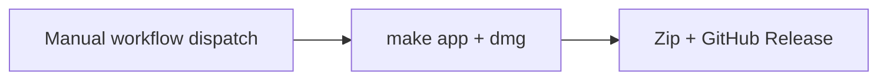

# Building CodexGateway

CodexGateway is built with **Swift Package Manager** (SPM). No Xcode project is required.

## Minimal setup

You only need **Xcode Command Line Tools**:

```bash
xcode-select --install
```

### Quick start

```bash
make build          # or: swift build -c release
make run            # builds + launches .build/CodexGateway.app (release)
make run-debug      # debug build + launch
make app            # creates dist/CodexGateway.app + DMG
make install        # copy dist/CodexGateway.app to /Applications/
```

You can also run the raw binary:

```bash
swift build -c release
./.build/release/CodexGateway
```

`make run` uses `scripts/build-dev-app.sh` for a lightweight `.app` wrapper; `make app` produces a full `dist/CodexGateway.app` for distribution. Both wrappers generate `AppIcon.icns` from the root `AppIcon.png` so Dock, app switcher, and confirmation dialogs use the CodexGateway icon.

## Packaging

```bash
make app     # creates dist/CodexGateway.app + dist/CodexGateway-macOS.dmg
make dmg     # same, with optional signing/notarization from .env
```

Output:

- `dist/CodexGateway.app`
- `dist/CodexGateway-macOS.dmg`

GitHub release assets use versioned names, e.g. `CodexGateway-v1.0.0.app.zip` and `CodexGateway-v1.0.0-macOS.dmg`. New releases no longer publish a `CodexBar-*.app.zip`. The in-app updater downloads `CodexGateway-{tag}.app.zip` from the newest **notarized** release only (`v{VERSION} (Notarized)` title or notarization phrase in release notes); it can still accept a legacy `CodexBar-{tag}.app.zip` if that asset exists on an older release. Unsigned CI releases are for manual install.

### Identity

| Item | Value |
|------|--------|
| Bundle ID | `com.rimusz.CodexGateway` |
| Config dir | `~/.codexgateway` |
| Install helper | `Contents/Resources/codexgateway-install-update` |
| GitHub repo | `rimusz/codex-gateway` (legacy `rimusz/codex-bar` redirects) |

### Upgrade / legacy (from CodexBar)

| Item | Legacy |
|------|--------|
| Bundle ID | `com.rimusz.CodexBar` — re-enable Open at Login after upgrade if needed |
| Config dir | `~/.codexbar` → auto-migrated to `~/.codexgateway` |
| Install helper | legacy `codexbar-install-update` |
| Release asset | older releases may still have `CodexBar-{tag}.app.zip`; new releases publish only `CodexGateway-{tag}.app.zip` |
| App folder | `CodexBar.app` → `CodexGateway.app` on first launch after an old-updater install (`AppBundleMigration`), or during install when updating from a post-rename build |
| Legacy exec alias | `Contents/MacOS/CodexBar` is a copy of `CodexGateway` so old ditto-merge upgrades still launch new code |

## Scripts

| Script | Purpose |
|--------|---------|
| `scripts/build-macos-app.sh` | Assemble `dist/CodexGateway.app`, optional `--sign` |
| `scripts/build-dev-app.sh` | Lightweight `.build/CodexGateway.app` for `make run` |
| `scripts/codesign-app-bundle.sh` | Ad-hoc or Developer ID codesign with `entitlements.plist` |
| `scripts/notarize.sh` | Submit signed app to Apple notary service + staple |
| `scripts/release.sh` | Local GitHub release publish (`make release`) |
| `scripts/codexgateway-install-update.sh` | Bundled helper for in-app update install (`Contents/Resources/codexgateway-install-update`) |
| `scripts/bundle-cursor-bridge.sh` | `npm install` + copy Cursor OpenAI sidecar into `Contents/Resources/CursorBridge` (Node ≥ 22.13; soft-skips if Node missing) |

## Codesigning / distribution

### Local config (`.env`)

```bash
cp .env.example .env
# edit .env with your SIGN_IDENTITY and NOTARY_PROFILE
```

`.env` is gitignored. The Makefile loads it automatically (`-include .env`).

```bash
make signed
make notarize
make dmg
make release RELEASE_TYPE=notarized
```

### Unsigned builds

macOS may block unsigned apps on first open:

1. Right-click `CodexGateway.app` → **Open**
2. `xattr -cr /Applications/CodexGateway.app`
3. System Settings → Privacy & Security → **Open Anyway**

## Versioning

Update `VERSION` before `make release`. The release tag must match (`v` + contents of `VERSION`).

## GitHub Releases

There are two ways to publish a release: **GitHub Actions** (recommended) or **local `make release`**. Use one path per version — not both at once.

Release title format (both paths):

- `v{VERSION} (Notarized)` — signed + notarized; recommended for distribution
- `v{VERSION} (Unsigned)` — development builds; Gatekeeper workarounds in release notes
- Release notes list **Downloads** (`CodexGateway-{tag}.app.zip` + DMG only); unsigned notes include Gatekeeper workarounds — see `scripts/release.sh` / `.github/workflows/release.yml`

### CI (unsigned)

Workflows: `.github/workflows/pr.yml` (PR checks), `.github/workflows/release.yml` (unsigned publish).

**PR checks:** run automatically on pull requests to `main` (`make test` + `make app`).

**Release trigger:** **Actions → Release → Run workflow** (manual dispatch only). Builds unsigned `.app` + DMG; no Apple secrets required.

Inputs:

- `version`: optional tag override; must match `VERSION` (e.g. `v1.0.0`)

Steps before dispatch:

1. Bump `VERSION`.
2. Commit and push to the branch you are releasing from.



Release title: `v{VERSION} (Unsigned)`. Notes include Gatekeeper bypass instructions.

**Notarized releases:** use local `make release RELEASE_TYPE=notarized` with `.env` (`SIGN_IDENTITY`, `NOTARY_PROFILE`). CI does not sign or notarize.

See `.github/workflows/README.md` for step-by-step workflow reference.

### Local (`make release`)

For publishing entirely from your Mac (requires [GitHub CLI](https://cli.github.com/) authenticated with `gh auth login`):

```bash
# 1. Bump VERSION, commit
# 2. Publish unsigned release (default)
make release
```

`make release` runs `scripts/release.sh`: builds, zips, creates/updates the GitHub release, and pushes tag `v{VERSION}` if needed. If that tag already exists on origin at a different commit (common when re-releasing after a failed publish), the script force-updates the lightweight/annotated tag ref. It resolves remote tags via `refs/tags/<tag>^{}` with a fallback to `refs/tags/<tag>` so existing lightweight tags are not mistaken for missing.

**Notarized local release** (with `.env` configured):

```bash
make release RELEASE_TYPE=notarized
```

Release uploads two assets per version: `CodexGateway-{tag}.app.zip` and `CodexGateway-{tag}-macOS.dmg`.
